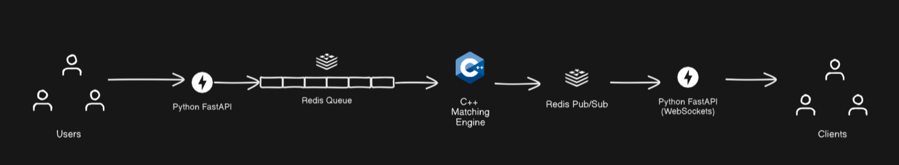
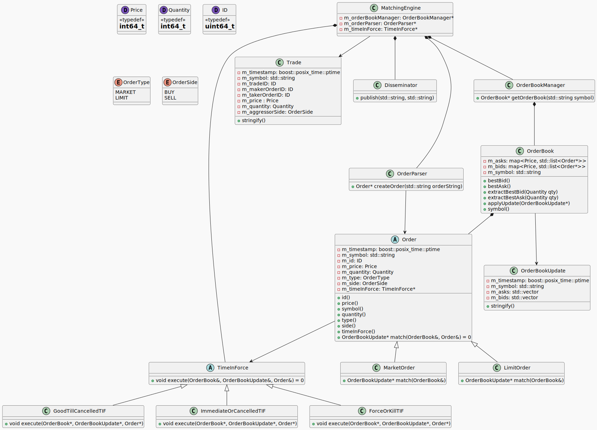

# MatchX
MatchX is an REG-NMS inspired C++ crypto matching engine that can process upto 20,000 orders per second. It was written as part of an online assessment for GoQuant's recruitment process by Prayag Jain.

# Features
- Order Types Supported: Market, Limit with time in force instructions: IOC (Immediate or Cancelled), FOK (Fill or Kill) and GTC (Good Till Cancelled).
- Multiple order books based on symbols. Each symbol has its own order book.
- Generates trade execution data and streams it to a WebSockets API.
- Generates market data and streams it to a WebSockets API.
- Prevents trade-throughs by following strict rules.
- Well documented code.
- Handles approximately 20,000 orders per second. If broadcasting is disabled, the number easily reaches 100,000 orders per second.

# Usage
## Docker
To test this program, you can use docker:
```bash
$ docker compose up --build
```

# Architecture
The program is divided into three services: `api`, `matchx` and `stream`. `api` is based on Python's FastAPI which provides a way to create new orders. `matchx` is the main C++ matching engine which reads from a Redis queue for incoming orders. `stream` is a WebSockets API which clients can subscribe to get real time updates in JSON format.
  
## High Level Design

The matching engine is based on a simple architecture. A python based FastAPI app let's users create new orders. These orders are converted to an order string which is then sent to a Redis queue. Matchx pops this item from the Redis queue and parses the order string to create a new Order and process it. After processing the order, order book updates are sent to a Redis pub/sub channel called "channel:market", while trade execution data is published to a channel called "channel:trade_execution". Another python FastAPI server subscribes to these channels and streams this data to websocket clients connected to it.

## Low Level Design
The C++ code documentation can be found [here](https://prayag2.github.io/matchx).

